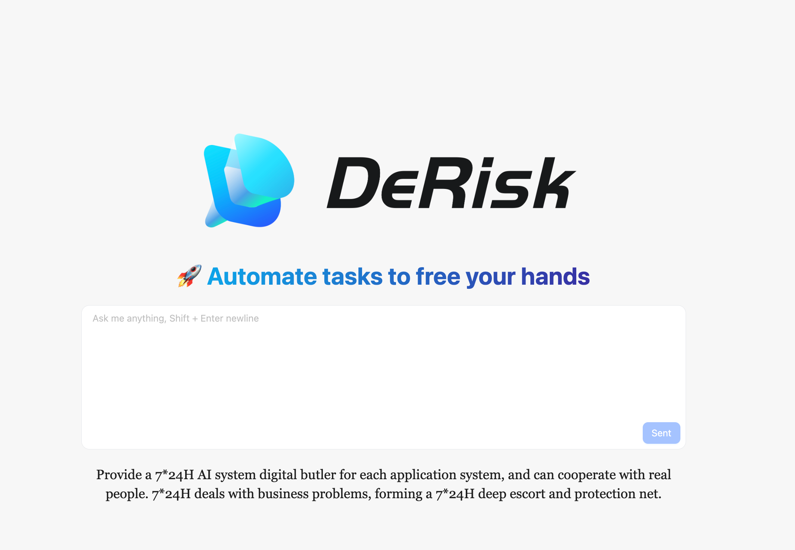

### DeRisk

DeRisk AI-Native Risk Intelligence Systems —— Your application system risk intelligent manager provides 7 * 24-hour comprehensive and in-depth protection.

<p align="center" >
    
</p>

<div align="center">
  <p>
    <a href="https://github.com/derisk-ai/derisk">
        
    </a>
    <a href="https://github.com/derisk-ai/derisk">
        
    </a>
    <a href="https://opensource.org/licenses/MIT">
      
    </a>
     <a href="https://github.com/derisk-ai/derisk/releases">
      
    </a>
    <a href="https://github.com/derisk-ai/derisk/issues">
      
    </a>
    <a href="https://codespaces.new/derisk-ai/derisk">
      
    </a>
  </p>
</div>

<p align="center" >
    
</p>

### Quick Start

Install uv

```python
curl -LsSf https://astral.sh/uv/install.sh | sh
```

####  Install Packages

```
uv sync --all-packages --frozen \
--extra "base" \
--extra "proxy_openai" \
--extra "rag" \
--extra "storage_chromadb"
```

#### Start
```
uv run python packages/derisk-app/src/derisk_app/derisk_server.py --config configs/derisk-proxy-deepseek.toml
```

#### Visit Website

Open your browser and visit [`http://localhost:7777`](http://localhost:7777)


### Acknowledgement 
Over the past two years, we established the [DB-GPT](https://github.com/eosphoros-ai/DB-GPT) project. 🏗️ To achieve better community collaboration and development, we decided to maintain a set of core foundational framework modules together with the [eosphoros-ai](https://github.com/eosphoros-ai) community. Based on this foundation, we will independently derive capabilities in the risk and data domains. 🔄 At the same time, to make each community's responsibilities and goals more focused, we decided to develop each field in the form of independent communities, with each community focusing on research and applications in their respective domains.

The DeRisk-AI community is dedicated to building AI-native risk intelligence systems. 🛡️ We hope our community can provide you with better services, and we also hope that you can join us to create a better future together. 🤝

### Community Group

Join our networking group on Feishu and share your experience with other developers!

<div align="center" style="display: flex; gap: 20px;">
    
</div>
