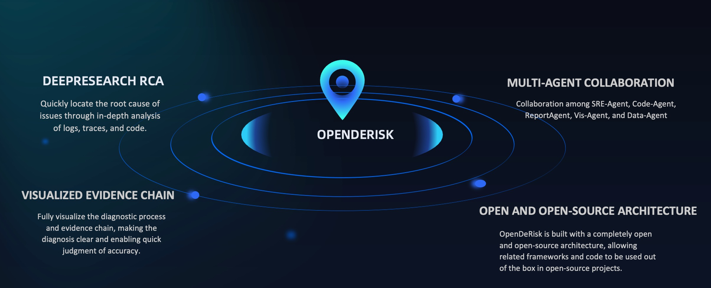
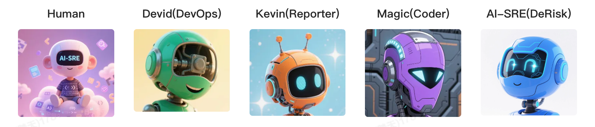
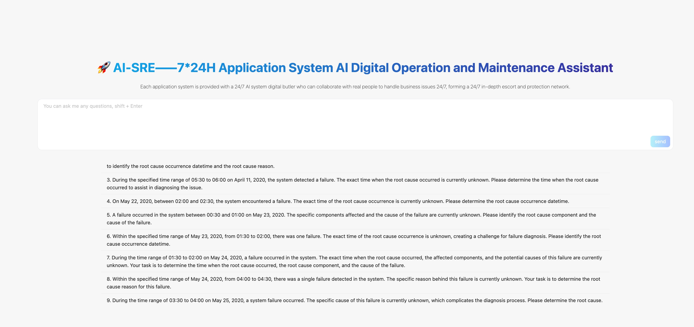
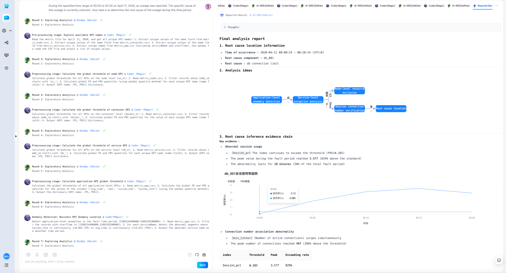
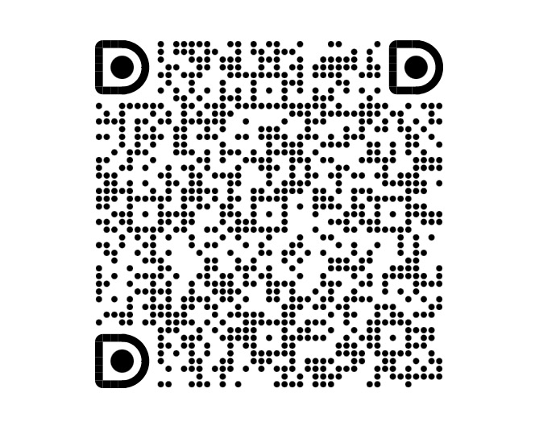

### OpenDeRisk

OpenDeRisk AI-Native Risk Intelligence Systems —— Your application system risk intelligent manager provides 7 * 24-hour comprehensive and in-depth protection.

<div align="center">
  <p>
    <a href="https://github.com/derisk-ai/OpenDerisk">
        
    </a>
    <a href="https://github.com/derisk-ai/OpenDerisk">
        
    </a>
    <a href="https://opensource.org/licenses/MIT">
      
    </a>
     <a href="https://github.com/derisk-ai/OpenDerisk/releases">
      
    </a>
    <a href="https://github.com/derisk-ai/OpenDerisk/issues">
      
    </a>
    <a href="https://codespaces.new/derisk-ai/OpenDerisk">
      
    </a>
  </p>

[**English**](README.md) | [**简体中文**](README.zh.md) | [**视频教程**](https://www.youtube.com/watch?v=1qDIu-Jwdf0)
</div>

[](https://star-history.com/#derisk-ai/OpenDerisk)

### Features
1. **DeepResearch RCA:** Quickly locate the root cause of issues through in-depth analysis of logs, traces, and code.
2. **Visualized Evidence Chain:** Fully visualize the diagnostic process and evidence chain, making the diagnosis clear and enabling quick judgment of accuracy.
3. **Multi-Agent Collaboration:** Collaboration among SRE-Agent, Code-Agent, ReportAgent, Vis-Agent, and Data-Agent.
4. **Open and Open-Source Architecture:** OpenDeRisk is built with a completely open and open-source architecture, allowing related frameworks and code to be used out of the box in open-source projects.

<p align="left">
  
</p>

### Architure
<p align="left">
  
</p>

The system adopts a multi-agent architecture. Currently, the code mainly implements the green-highlighted parts. Alert awareness is based on Microsoft's open-source [OpenRCA dataset](https://github.com/microsoft/OpenRCA). The dataset size is approximately 26GB after decompression. On this dataset, we achieve root cause analysis and diagnosis through multi-agent collaboration, where the Code-Agent dynamically writes code for final analysis.

#### Technical Implementation
**Data Layer:** Pull the large-scale OpenRCA dataset (20GB) from GitHub, decompress it locally, and process it for analysis.

**Logic Layer:** Multi-agent architecture, with collaboration among SRE-Agent, Code-Agent, ReportAgent, Vis-Agent, and Data-Agent to perform in-depth DeepResearch RCA (Root Cause Analysis).

**Visualization Layer:** Use the Vis protocol to dynamically render the entire processing flow and evidence chain, as well as the process of multi-role collaboration and switching.

Digital Employees (Agents) in OpenDeRisk
<p align="left">
  
</p>

### Quick Start

Install uv

```python
curl -LsSf https://astral.sh/uv/install.sh | sh
```

####  Install Packages

```
uv sync --all-packages --frozen \
--extra "base" \
--extra "proxy_openai" \
--extra "rag" \
--extra "storage_chromadb" \
--extra "client" \
--index-url=https://pypi.tuna.tsinghua.edu.cn/simple
```

#### Start

Configure the API_KEY in the derisk-proxy-deepseek.toml file, then run the following command to start.


> Note: By default, we use the Telecom dataset from the OpenRCA dataset. You can download it via the link or the following command:

> gdown https://drive.google.com/uc?id=1cyOKpqyAP4fy-QiJ6a_cKuwR7D46zyVe

After downloading, modify the dataset path in the file [basic_prompt_Telecom.py](https://github.com/derisk-ai/OpenDerisk/blob/main/packages/derisk-ext/src/derisk_ext/ai_sre/resource/basic_prompt_Telecom.py) to the local absolute path.


Run the startup command:
```
uv run python packages/derisk-app/src/derisk_app/derisk_server.py --config configs/derisk-proxy-deepseek.toml
```

#### Visit Website

Open your browser and visit [`http://localhost:7777`](http://localhost:7777)
<p align="left">
  
</p>

#### Execution Results
As shown in the figure below, this demonstrates a scenario where multiple agents collaborate to handle a complex operational diagnostic task.

<p align="left">
  
</p>

### Acknowledgement 
- [DB-GPT](https://github.com/eosphoros-ai/DB-GPT)
- [GPT-Vis](https://github.com/antvis/GPT-Vis)
- [MetaGPT](https://github.com/FoundationAgents/MetaGPT)
- [OpenRCA](https://github.com/microsoft/OpenRCA)

The OpenDeRisk-AI community is dedicated to building AI-native risk intelligence systems. 🛡️ We hope our community can provide you with better services, and we also hope that you can join us to create a better future together. 🤝

### Community Group

Join our networking group on Dingding and share your experience with other developers!

<div align="center" style="display: flex; gap: 20px;">
    
</div>

