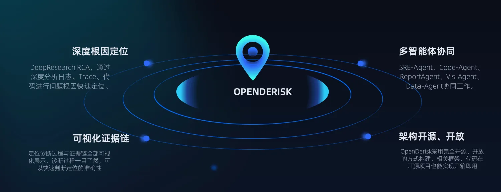
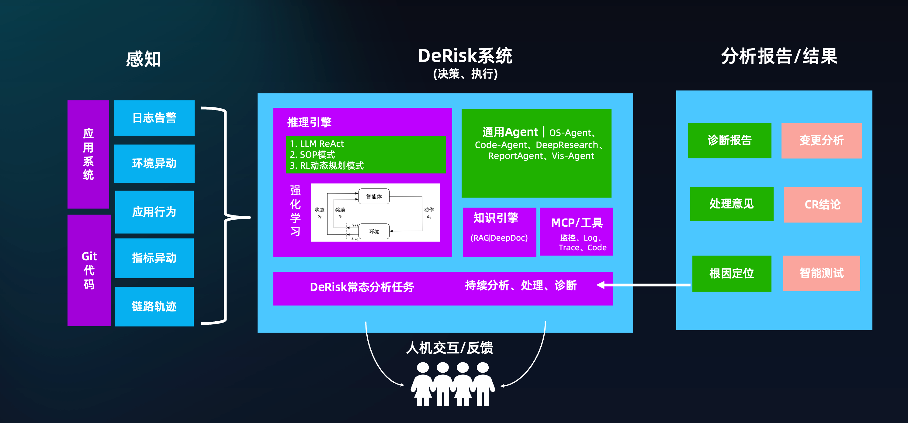
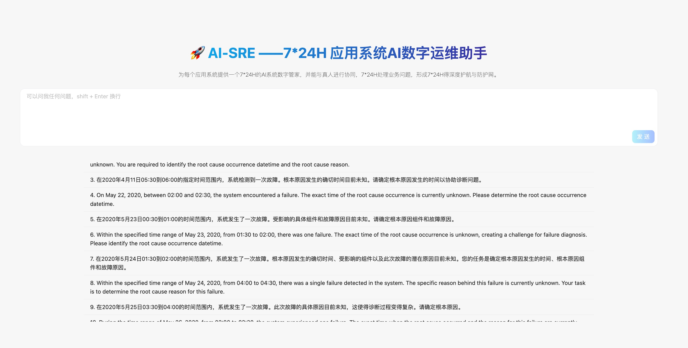

### OpenDeRisk

OpenDeRisk AI 原生风险智能系统 —— 7*24H 应用系统AI数字运维助手(AI-SRE), 我们的愿景是, 为每个应用系统提供一个7*24H的AI系统数字管家，并能与真人进行协同，7*24H处理业务问题，形成7*24H得深度护航与防护网。

<div align="center">
  <p>
    <a href="https://github.com/derisk-ai/OpenDerisk">
        
    </a>
    <a href="https://github.com/derisk-ai/OpenDerisk">
        
    </a>
    <a href="https://opensource.org/licenses/MIT">
      
    </a>
     <a href="https://github.com/derisk-ai/OpenDerisk/releases">
      
    </a>
    <a href="https://github.com/derisk-ai/OpenDerisk/issues">
      
    </a>
    <a href="https://codespaces.new/derisk-ai/OpenDerisk">
      
    </a>
  </p>

[**English**](README.md) | [**简体中文**](README.zh.md) | [**视频教程**](https://www.youtube.com/watch?v=1qDIu-Jwdf0)
</div>


### 特性
<p align="left">
  
</p>

1. DeepResearch RCA: 通过深度分析日志、Trace、代码进行问题根因的快速定位。
2. 可视化证据链：定位诊断过程与证据链全部可视化展示，诊断过程一目了然，可以快速判断定位的准确性。
3. 多智能体协同: SRE-Agent、Code-Agent、ReportAgent、Vis-Agent、Data-Agent协同工作。
4. 架构开源开放: OpenDerisk采用完全开源、开放的方式构建，相关框架、代码在开源项目也能实现开箱即用。

### 架构方案 
<p align="left">
  
</p>

采用多Agent架构，目前代码中主要实现了绿色部分部分，告警感知采用的是微软开源的[OpenRCA数据集](https://github.com/microsoft/OpenRCA), 数据集的大小解压后在26G左右，我们实现在26G的数据集合上，通过多Agent协同，Code-Agent动态写代码来进行最终根因的分析诊断。

#### 技术实现
1. 数据层:  拉取Github OpenRCA的大规模数据集(20G),  解压本地处理分析。 
2. 逻辑层：Multi-Agent架构, 通过SRE-Agent、Code-Agent、ReportAgent、VisAgent、Data-Agent协同合作，进行深度的DeepResearch RCA(Root Cause Analyze)
3. 可视化层: 采用Vis协议、动态渲染整个处理流程与证据链, 以及多角色协同切换的过程。

4. OpenDeRisk中的数字员工(Agent)
<p align="left">
  
</p>

### 快速开始

Install uv

```python
curl -LsSf https://astral.sh/uv/install.sh | sh
```
#### 依赖包安装 

```
uv sync --all-packages --frozen \
--extra "base" \
--extra "proxy_openai" \
--extra "rag" \
--extra "storage_chromadb" \
--extra "client" \
--index-url=https://pypi.tuna.tsinghua.edu.cn/simple
```

#### 启动 

配置`derisk-proxy-deepseek.toml`文件中相关的API_KEY, 然后运行下面的命令启动。

> !注意, 我们默认使用OpenRCA数据集中的[Telecom数据集](https://drive.usercontent.google.com/download?id=1cyOKpqyAP4fy-QiJ6a_cKuwR7D46zyVe&export=download&confirm=t&uuid=42621058-41af-45bf-88a6-64c00bfd2f2e), 你可以通过链接, 或者下述命令进行下载

```
gdown https://drive.google.com/uc?id=1cyOKpqyAP4fy-QiJ6a_cKuwR7D46zyVe

```

下载完成后, 修改[basic_prompt_Telecom.py](https://github.com/derisk-ai/OpenDerisk/blob/main/packages/derisk-ext/src/derisk_ext/ai_sre/resource/basic_prompt_Telecom.py)文件中的数据集路径为本地绝对路径。

运行启动命令:
```
uv run python packages/derisk-app/src/derisk_app/derisk_server.py --config configs/derisk-proxy-deepseek.toml
```

#### 访问 
打开浏览器访问 [`http://localhost:7777`](http://localhost:7777)

<p align="left">
  
</p>


#### 运行效果
如下图所示, 为多智能体协同运行处理一个复杂的运维诊断任务的场景。
<p align="left">
  
</p>

### 致谢 
- [DB-GPT](https://github.com/eosphoros-ai/DB-GPT)
- [GPT-Vis](https://github.com/antvis/GPT-Vis)
- [MetaGPT](https://github.com/FoundationAgents/MetaGPT)
- [OpenRCA](https://github.com/microsoft/OpenRCA)

OpenDeRisk-AI 社区致力于构建 AI 原生的风险智能系统。🛡️ 我们希望我们的社区能够为您提供更好的服务，同时也希望您能加入我们，共同创造更美好的未来。🤝


[](https://star-history.com/#derisk-ai/OpenDerisk)

### 社区 

加入钉钉群, 与我们一起交流讨论。 

<div align="center" style="display: flex; gap: 20px;">
    
</div>
